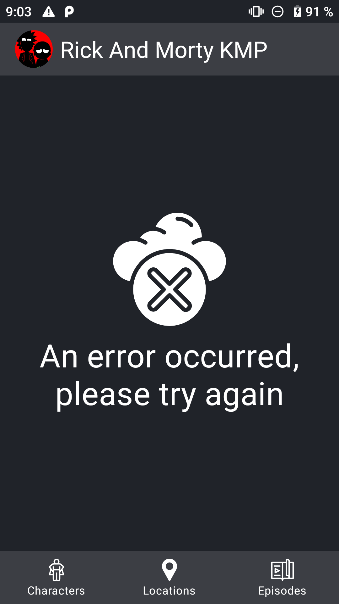
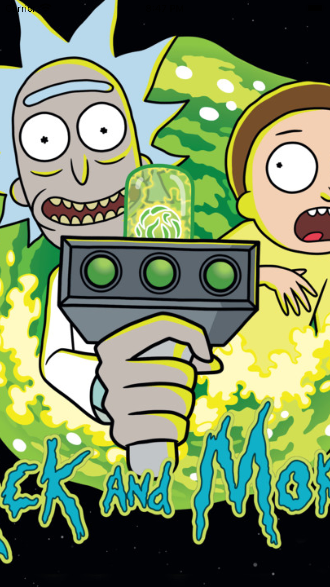

# Rick And Morty Kotlin Multiplatform App

An App architecture example based on Kotlin Multiplatform Mobile

 ## Tech stack & Open-source libraries
 
 - Kotlin Multiplaform
  - Ktor (multiplatform asynchronous HTTP client).
  - SQLDelight (SQLDelight generates typesafe kotlin APIs from your SQL statements).

 ## Screenshots
 
  ### Android App version

 
 
 
 
 
 ### IOS App version

 
 
 
 
 
 
 ## Visitors Count

## Please Share & Star the repository to keep me motivated.
  
  
